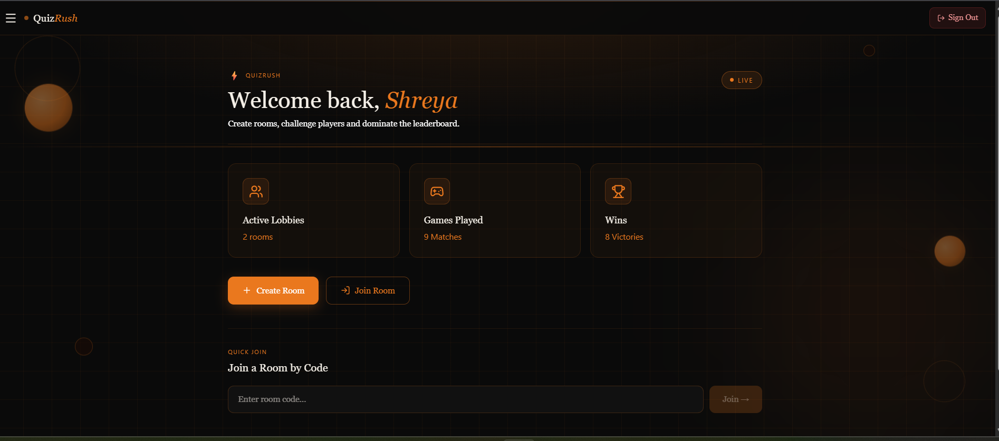
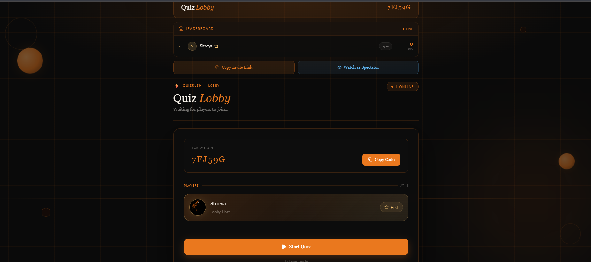
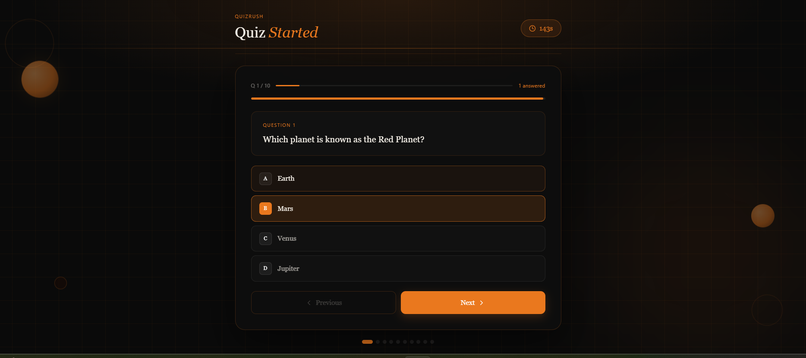
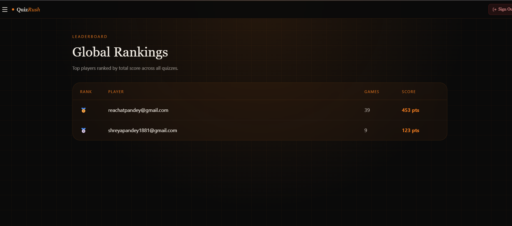
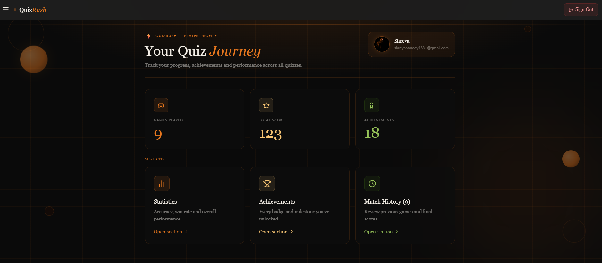

🚀 QuizRush

The Real-Time Multiplayer Quiz Battle Platform

Create lobbies. Compete live. Climb the leaderboard.

Live Demo · How It Works · Report Bug · Request Feature


📌 Overview

QuizRush is a real-time multiplayer quiz platform built with Next.js and Socket.IO where players can join or create live lobbies, compete in timed quizzes, and track scores instantly on dynamic leaderboards.

It is designed for low-latency gameplay, scalable lobby systems, and smooth real-time synchronization.


🧠 Features
⚡ Real-Time Gameplay
Live question streaming using Socket.IO
Instant answer submission and scoring
Synchronized timers for all players
Server-controlled game flow

🏠 Lobby System
Create & join public/private lobbies
Unique shareable lobby codes
Live player tracking
Host-controlled start system

🏆 Leaderboard System
Live score updates
Final match rankings
Player performance tracking

🔐 Authentication
Google OAuth via NextAuth
Persistent user sessions
Secure role-based access

### Landing Page


### Home Page


### Lobby Screen


### Questions Page


### Leaderboard


### Profile Page



🛠️ Tech Stack
Framework: Next.js (App Router)
Language: TypeScript
Realtime: Socket.IO
Styling: Tailwind CSS
State Management: Zustand
Database: PostgreSQL (Neon)
ORM: Drizzle ORM
Auth: NextAuth.js
Runtime: Bun
Deployment: Vercel + Render (Socket Server)


📁 Project Structure
multiplayer-quiz-game/
├── app/
│
│   ├── (dashboard)/
│   │   ├── home/
│   │   │   └── page.tsx
│   │   │
│   │   ├── games/
│   │   │   ├── page.tsx
│   │   │   └── [gameId]/
│   │   │       └── page.tsx
│   │   │
│   │   └── leaderboard/
│   │       └── page.tsx
│   │
│   ├── lobby/
│   │   └── [lobbyId]/
│   │       ├── page.tsx
│   │       └── QuizLobbyClient.tsx
│   │
│   ├── quiz/
│   │   └── [lobbyId]/
│   │       └── results/
│   │           └── page.tsx
│   │
│   ├── profile/
│   │   ├── achievements/page.tsx
│   │   ├── history/page.tsx
│   │   └── stats/page.tsx
│   │
│   ├── signup/page.tsx
│   ├── layout.tsx
│   └── page.tsx
│
│
├── app/api/
│
│   ├── auth/
│   │   └── [...nextauth]/route.ts
│   │
│   ├── lobby/
│   │   ├── create/route.ts
│   │   ├── join/route.ts
│   │   ├── leave/route.ts
│   │   ├── start/route.ts
│   │   └── details/route.ts
│   │
│   ├── lobbies/route.ts
│   ├── questions/route.ts
│   ├── quiz-progress/route.ts
│   └── leaderboard/route.ts
│
├── components/
│
│   ├── quiz/
│   │   ├── QuestionCard.tsx
│   │   ├── QuestionOptions.tsx
│   │   ├── QuizTimer.tsx
│   │   ├── ScoreBoard.tsx
│   │   ├── PlayersList.tsx
│   │   ├── ResultModal.tsx
│   │   ├── LobbyCard.tsx
│   │   └── JoinLobbyDialog.tsx
│   │
│   ├── layout/
│   │   ├── Navbar.tsx
│   │   ├── SideBar.tsx
│   │   ├── adminSidebar.tsx
│   │   └── authProvider.tsx
│   │
│   └── ui/
│       └── homeButtons.tsx
├── lib/
│
│   ├── socket/
│   │   ├── socket.ts  
│   │   ├── gameStore.ts          
│   │   ├── scoreHandlers.ts  
│   │   ├── timers.ts       
│   │   ├── lobbyHandlers.ts       
│   │   ├── playerHandler.ts     
│   │   └── types.ts
│   │
│   ├── game/
│   │   ├── questionManager.ts     
│   │   └── types.ts
│   │
│   └── utils.ts
│
├── hooks/
│   ├── useSocket.ts
│   ├── useLobby.ts
│
│
├── store/
│   ├── quizStore.ts
│   └── socketStore.ts
│
├── drizzle/
│   └── db/
│       ├── index.ts
│       └── schema.ts
│
├── data/
│   └── questions.json
│
├── scripts/
│   ├── createAdmin.ts
│   └── testGemini.ts
│
├── types/
│   ├── lobby.ts
│   ├── player.ts
│   ├── question.ts
│   ├── quiz.ts
│   ├── socket.ts
│   ├── auth.ts
│   ├── leaderboard.ts
│   └── user.ts
│
├── actions/
│   ├── CreateLobby.ts
│   ├── JoinLobby.ts
│   ├── StartQuiz.ts
│   ├── SubmitAnswer.ts
│   └── CalculateScore.ts
│
├── server.ts
├── next.config.ts
├── tsconfig.json
├── drizzle.config.ts
├── package.json
└── .env


🚀 Getting Started

1. Install dependencies
   bun install
2. Run development server
   bun dev


Open:

http://localhost:3000
⚙️ Environment Variables
DATABASE_URL=your_postgres_url
NEXTAUTH_URL=http://localhost:3000
NEXTAUTH_SECRET=your_secret
SOCKET_SERVER_URL=http://localhost:3002
GOOGLE_CLIENT_ID=your_google_client_id
GOOGLE_CLIENT_SECRET=your_google_client_secret


🚀 Deployment
Frontend (Vercel)
bun run build
vercel deploy
Socket Server (Render / Railway)
Deploy server.ts
Enable WebSockets
Set environment variables


📈 Roadmap
Ranked matchmaking system
Tournament mode
Mobile app (React Native)
AI-generated questions
Advanced analytics dashboard

## 🤝 Contributing

We welcome contributions to QuizRush 🚀

Follow these steps:

1. Fork the repository  
2. Create a new branch:
   ```bash
   git checkout -b feat/your-feature


   
---

# 📜 License (clean version)

```md id="license1"
## 📜 License

This project is licensed under the **MIT License**.

You are free to use, modify, and distribute this project with attribution.

🔗 Live
👉 https://quiz-rush-lac.vercel.app

Built with ❤️ for real-time competition lovers
